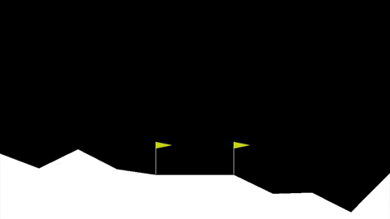

# Reinforcement Learning Specialization

[Reinforcement Learning Specialization](https://www.coursera.org/specializations/reinforcement-learning) by University of Alberta & Alberta Machine Intelligence Institute on Coursera.

## About this Specialization

> The Reinforcement Learning Specialization consists of 4 courses exploring the power of adaptive learning systems and artificial intelligence (AI).

> Harnessing the full potential of artificial intelligence requires adaptive learning systems. Learn how Reinforcement Learning (RL) solutions help solve real-world problems through trial-and-error interaction by implementing a complete RL solution from beginning to end.

> By the end of this Specialization, learners will understand the foundations of much of modern probabilistic artificial intelligence (AI) and be prepared to take more advanced courses or to apply AI tools and ideas to real-world problems. This content will focus on “small-scale” problems in order to understand the foundations of Reinforcement Learning, as taught by world-renowned experts at the University of Alberta, Faculty of Science.

> The tools learned in this Specialization can be applied to game development (AI), customer interaction (how a website interacts with customers), smart assistants, recommender systems, supply chain, industrial control, finance, oil & gas pipelines, industrial control systems, and more.

## 